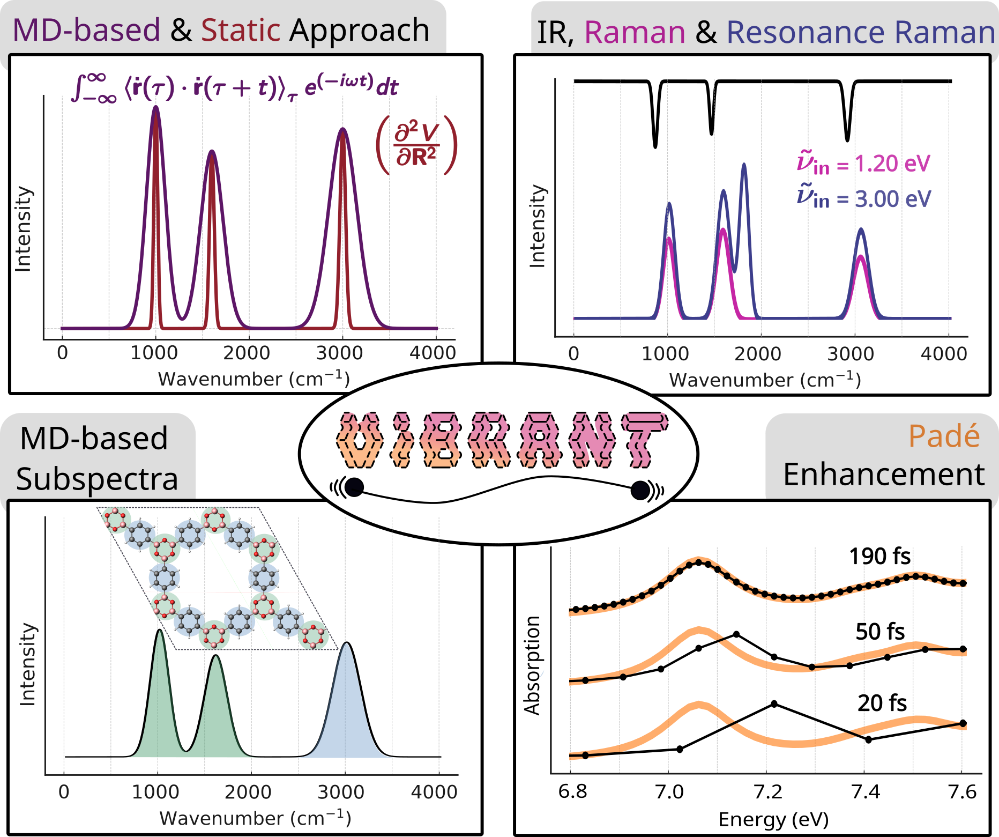

# Summary 

In this work, we present Vibrant, a vibrational analysis program written in Fortran 2008 with interfaces to the FFTW and GreenX (GX-AC) libraries and parallelized using OpenMP for maximum efficiency. Vibrant enables the generation of vibrational spectra for a wide range of matierals through post-processing atomic positions, velocities, forces, polarizability tensors and static or time-dependent dipole moments. Its functionalities include the computation of both static and molecular dynamics (MD)-based infrared (IR), Raman, resonance Raman (RR) and absorption spectra, as well as frequency analyses such as normal mode analysis and power spectrum calculations. Vibrant is distrubed under the Apache 2.0 license and is available as open-source software on GitHub.

# Statement of need

why do we need vibrant

citing ekins paper here [@ekin2024]

# State of the field

Currently, there are only a limited number of computational programs available for calculating molecular dynamics (MD)-based and static vibrational spectra. A prominent example is TRAVIS, which can process a wide range of properties obtained from MD simulations to compute various types of spectra and correlation functions, including power, IR, Raman, resonance Raman, vibrational circular dichroism, and vibrational optical activity, in addition to distribution functions such as the radial distribution function. However, TRAVIS is mainly designed for liquid systems, and in order to compute aforementioned spectra, it processes either Wannier centers, or uses the electronic density to perform Voronoi integration. Other than TRAVIS, there are Python-based scripts, for example, those that process CP2K polarizability tensors to generate static Raman spectra, or the scripts distributed with FHI-aims, which can read FHI-aims output files to perform normal mode analysis or compute static IR and Raman spectra. Another widely used tool is Phonopy, which is highly effective for calculating phonon dispersion relations and vibrational densities of state; however, it is not designed for post-processing time-dependent quantities such as dipole moments or polarizabilities that come from MD or RT-TDDFT simulations.

To the best of our knowledge, there is currently no computational tool that offers the flexibility to post-process both Wannier centers and external static or time-dependent dipole moments and polarizability tensors, derived from either normal mode analysis, MD simulations or RT-TDDFT calculations.

Vibrant provides a flexible and efficient environment for post-processing different types of properties and computing static and MD-based vibrational spectra for gas-phase, liquid, and solid-state systems. Furthermore, Vibrant enables the computation of subspectra for user-defined molecular fragments, a feature which is not available in other codes. Another significant aspect of Vibrant is that it features the implementation of Padé approximants and is integrated with OpenMP parallelization. This feature promotes the computation of a well-resolved resonance Raman or absorption spectra even from relatively short RT-TDDFT trajectories.

# Acknowledgements

# References
