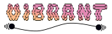

<div align="center">
<picture>
  <source media="(prefers-color-scheme: dark)" srcset="docs/_static/all_img/logo_vibrant_dark.svg">
  <source media="(prefers-color-scheme: light)" srcset="docs/_static/all_img/logo_vibrant.svg">
  
</picture>
</div>

---

[](https://github.com/lstsgroup/vibrant/actions/workflows/action.yml)


## Quick install

The CMake build framework is used in order to compile the `vibrant` code. To install it type the following in the root directory of the repository and make sure that you have a working GNU fortran compiler (e.g. `gfortran`):
```bash 
mkdir build && cd build 
cmake ..
make -j 5
```
Optional: Test if the installation is working as expected by typing 
```bash
ctest 
```
in the build directory to run the regression tests.

For more a more fine-grained installation please refer to the [documentation of vibrant](https://lstsgroup.github.io/vibrant/Installation.html).

## Documentation

For more Information about the vibrant code please consult the extensive [documentation website](https://lstsgroup.github.io/vibrant/).

## Contributing

Contributions to vibrant are highly appreciated! If you consider contributing [check out CONTRIBUTING.md](https://github.com/lstsgroup/vibrant/blob/main/CONTRIBUTING.md)

## License note

Vibrant is distributed under the [Apache 2.0](https://www.apache.org/licenses/LICENSE-2.0.txt) license. Please note that, while the source code is licensed permissively under Apache 2.0, any compiled binary is subject to the [GPL v2](https://www.gnu.de/documents/gpl-2.0.en.html) license due to its dependency on [FFTW](https://www.fftw.org/).
