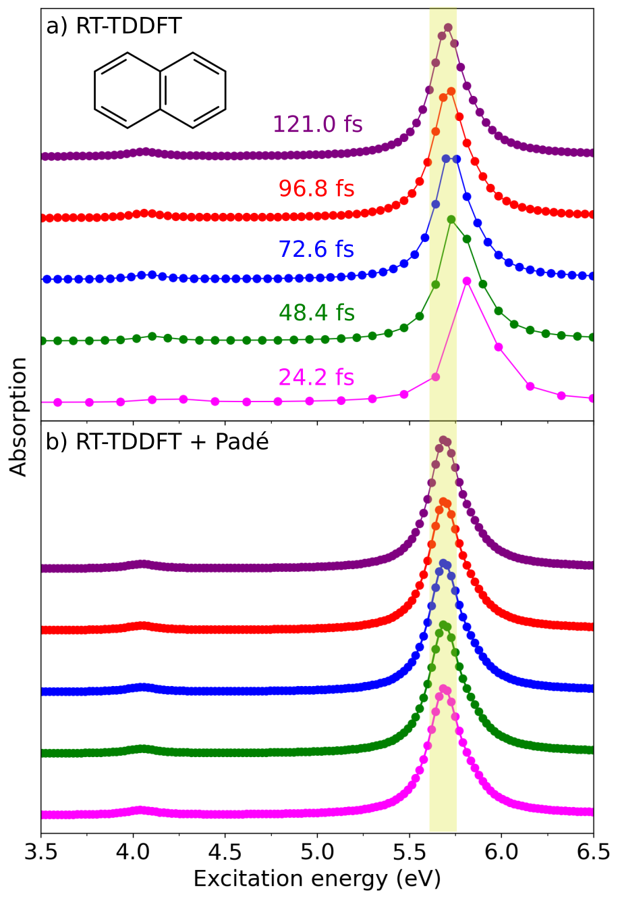

# Resonance Raman (RR) and absorption spectra

Vibrant can compute static or molecular dynamics (MD)-based resonance Raman (RR) and absorption spectra processing the induced dipole moments calculated via real-time time-dependent density functional theory (RT-TDDFT). [RT-TDDFT](https://pubs.acs.org/doi/10.1021/acs.chemrev.0c00223) models resonance effects by propagating the electron density in real time under a small external perturbation, enabling the full excitation spectrum to be captured from a single simulation via Fourier transformation of the time-dependent polarizabilities. This is an important advantage when compared to the more commonly used linear-response TDDFT (LR-TDDFT), which requires specifying a subset of excitations. As a result, the RT-TDDFT-based approach is efficient and easily combinable with both static and MD-based simulations.

Vibrant calculates the RR intensities for a range of incident laser wavelengths $\tilde{\nu}_{in}$ specified in the input file via the `laser_in` keyword in the `raman` section. Every RR spectrum calculated for a different laser wavenumber are appended as additional columns.

More details on the differences of static and MD-based RR and absorption spectra are provided in the following sections, together with the details on the Padé post-processing which significantly enhances the spectral resolution.

## a) Static RR and absorption intensities

The static RR calculation in Vibrant relies on the normal mode analysis within the harmonic approximation. The static RR intensities are computed from the derivatives of the frequency-dependent polarizability tensors $\boldsymbol{\alpha}$ with respect to the mass-weighted normal coordinates $Q_{p}$. Following [Placzek's polarization theory](https://onlinelibrary.wiley.com/doi/book/10.1002/0470845767), the [RR intensity](https://pubs.acs.org/doi/full/10.1021/acs.jctc.9b00512) at laser frequency $\omega$ for each normal mode frequency $\tilde{\nu}_{p}$ is given as:

$$
I_{\textnormal{RR}} (\tilde{\nu}_{p}, \omega) = \frac{h}{8\epsilon_{0}^{2}c} \frac{(\omega-\tilde{\nu}_{p})^{4}}{\tilde{\nu}_{p} \left(1-\exp\left(-\frac{hc\tilde{\nu}_{p}}{k_{B}T}\right)\right)}  \frac{45\beta^{2}_{p} (\omega)+7\gamma_{p}^{2}(\omega) }{45} 
$$

where $h$ is the Planck’s constant, $\varepsilon_{0}$ is the vacuum permittivity, $c$ is speed of the light, $k_{B}$ is the Boltzmann constant, $T$ is the temperature. [$X$ and $Y$](https://onlinelibrary.wiley.com/doi/book/10.1002/0470845767) can take different values depending on the polarization configuration of the scattered light as explained in Section [Raman spectra](Raman_spec.md). $\beta^{2}_{p}(\omega)$ and $\gamma_{p}^{2}(\omega)$ correspond to the frequency-dependent isotropic and anisotropic contributions, respectively. They are computed from the derivatives of the dynamic polarizability tensor $\boldsymbol{\alpha}(\omega ,\tilde{\nu}_p)$ with respect to the normal mode coordinate $\boldsymbol{Q}_{p}$. $\beta^{2}_{p}(\omega)$ includes the diagonal components of $\boldsymbol{\alpha}(\omega ,\tilde{\nu}_p)$:

$$
\beta^{2}_{p}(\omega)=\frac{1}{9}\left ( \frac{\partial \alpha _{xx}(\omega)}{\partial \boldsymbol{Q}_{p}}+\frac{\partial\alpha _{yy}(\omega) }{\partial \boldsymbol{Q}_{p}} +\frac{\partial \alpha _{zz}(\omega)}{\partial \boldsymbol{Q}_{p}}\right )^{2}
$$

And $\gamma_{p}^{2}(\omega)$ includes also the off-diagonal terms:

$$
\gamma_{p}^{2}(\omega) =
 \frac{1}{2}\left(\frac{\partial \alpha_{xx}}{\partial \mathbf{Q}_{p}}
 - \frac{\partial \alpha_{yy}}{\partial \mathbf{Q}_{p}}\right)^{2}
 + \frac{1}{2}\left(\frac{\partial \alpha_{yy}}{\partial \mathbf{Q}_{p}}
 - \frac{\partial \alpha_{zz}}{\partial \mathbf{Q}_{p}}\right)^{2}
 + \frac{1}{2}\left(\frac{\partial \alpha_{zz}}{\partial \mathbf{Q}_{p}}
 - \frac{\partial \alpha_{xx}}{\partial \mathbf{Q}_{p}}\right)^{2}
 + 3\left(\frac{\partial \alpha_{xy}}{\partial \mathbf{Q}_{p}}\right)^{2}
 + 3\left(\frac{\partial \alpha_{yz}}{\partial \mathbf{Q}_{p}}\right)^{2}
 + 3\left(\frac{\partial \alpha_{zx}}{\partial \mathbf{Q}_{p}}\right)^{2}
$$

The [absorption intensities](https://pubs.aip.org/aip/jcp/article/149/17/174108/197213) are computed from the trace of the frequency-dependent absorption cross-section tensor $\boldsymbol{\sigma}(\omega)$:

$$
I_{\textnormal{abs}} (\omega) = \frac{1}{3}\textnormal{Tr}\left[ \boldsymbol{\sigma}(\omega) \right]
$$

where $\boldsymbol{\sigma}(\omega)$ contains only the diagonal components of the imaginary part of the dynamic polarizability tensor $\alpha(\omega)$, as given by:

$$
\sigma_{ii} (\omega) = \frac{4 \pi \omega}{c}\textnormal{Im}\left[ \alpha_{ii} (\omega) \right] \quad \textnormal{with} \quad i = x, y, z
$$

The dynamic polarizability tensor $\boldsymbol{\alpha}(\omega)$ is computed from the frequency-dependent induced dipole moment ${\mu}^{j}_{i}(\omega)$:  

$$
\alpha_{ij}(\omega) = \frac{{\mu}^{j}_{i}(\omega) }{E} \quad \textnormal{with} \quad i, j = x, y, z
$$

where ${E}$ is an electric field applied along the $x$-, $y$-, or $z$-direction. ${\mu}^{j}_{i}(\omega)$ is obtained via applying a fast Fourier transform to the  time-dependent induced dipoles using the [FFTW](https://www.fftw.org/) library:

$$
{\mu}^{j}_i(\omega) = \int_{0}^{T} \left( {\mu}^{j}_i(t)  - \mu^{0}_{i} \right) e^{i \omega t} e^{- \Gamma t} \mathrm{d}t
$$

where $T$ is the total RT-TDDFT simulation time, $t$ is the RT-TDDFT time step, ${\mu}^{j}_i(t)$ is the time-dependent dipole moment under the electric field applied in the $j$ direction, $\mu^{0}_{i}$ denotes the initial static dipole moment of the unperturbed system, and $\Gamma$ is the [damping factor](https://pubs.aip.org/aip/jcp/article/138/4/044101/193408).

To compute a static RR spectrum, the user must provide the time-dependent dipole moments for each displaced structure, combined into a single file (see [File Formats](file_formats.md) for details). There should be three files in total, each corresponding to calculations performed under electric fields applied along the x-, y-, and z-directions. An example input section for performing a static RR calculation is shown below:

```bash
&global
 spectra RR
 temperature <temperature_in_K>
 fwhm <full_width_at_half_maximum>
&end global
&system
 filename <optimized_geometry_file_name>
&end system
&static
... 
&end static
&dipoles
 type_dipole berry
 field_strength <electric_field_strength_in_au>
 dip_x_file <time_dependent_dipole_file_under_x_field>
 dip_y_file <time_dependent_dipole_file_under_y_field>
 dip_z_file <time_dependent_dipole_file_under_z_field>
&end dipoles
&rtp
 rtp_time_step <rtp_time_step_in_fs>
 rtp_framecount <total_rtp_framecount>
 damping_constant <damping_factor_in_eV>
&end rtp
...
```

`rtp` section provides the necessary information about the RT-TDDFT parameters. The `static` section should be given similar to the [static Raman](Raman_spec.md) input. Complete input files can be found at ....

Vibrant applies Gaussian broadening to the final discrete set of frequencies and intensities. The `fwhm` keyword controls the full width at half-maximum (FWHM) value in cm ${^{-1}}$ and if not specified, it is set to 5 cm ${^{-1}}$.

```{note}
  The keyword `write_mol_file` is optional and it executes the printing of a `<filename>.mol` file, which includes the optimized geometry, normal mode frequencies, normal mode coordinates and the non-broadened Raman intensities. The `<filename>.mol` file can be opened with [MOLDEN](https://www.theochem.ru.nl/molden/) to visualize the normal modes alongside the Raman spectrum. If multiple incident laser frequencies are requested, Vibrant generates a separate `<filename>.mol` file for each frequency.
```

The absorption spectrum calculation does not require the `static` section. An example input section is given below:

```bash
&global
 spectra ABS
&end global
&system
 ...
&end system
&dipoles
 type_dipole berry
 field_strength <electric_field_strength_in_au>
 dip_x_file <time_dependent_dipole_file_under_x_field>
 dip_y_file <time_dependent_dipole_file_under_y_field>
 dip_z_file <time_dependent_dipole_file_under_z_field>
&end dipoles
&rtp
 rtp_time_step <rtp_time_step_in_fs>
 rtp_framecount <total_rtp_framecount>
 damping_constant <damping_factor_in_eV>
&end rtp
```

The final static resonance Raman intensities are reported in 10 $^{-30}$ cm $^2$ /sr. The absorption spectrum frequencies are reported in eV and the intensities are reported in atomic units.

## b) MD-based RR intensities

In an MD-based RR calculation, the polarizability derivatives along the normal mode coordinates $Q_{p}$ are replaced with the [time derivatives of the polarizability autocorrelation functions](https://pubs.rsc.org/en/content/articlehtml/2013/cp/c3cp44302g) similarly to the MD-based Raman calculation. We applied fast Fourier transformations to the time-domain dynamic polarizability autocorrelations using the [FFTW](https://www.fftw.org/) library to convert them into the frequency-domain. The [MD-based RR intensities](https://pubs.acs.org/doi/full/10.1021/acs.jctc.9b00512) at laser frequency $\omega$ is expressed as a linear combination of isotropic and anisotropic polarizabilities:

$$
I_{\textnormal{RR}} (\tilde{\nu}, \omega) = \frac{2h}{8\epsilon_{0}^{2}k_{B}T} \frac{(\omega-\tilde{\nu})^{4}}{\tilde{\nu}} \frac{1}{1-\exp\left(-\frac{hc\tilde{\nu}}{k_{B}T}\right)}\frac{X\delta^{2} (\tilde{\nu}, \omega)+Y\epsilon^{2} (\tilde{\nu}, \omega) }{45} 
$$

where $h$ is the Planck’s constant, $\varepsilon_{0}$ is the vacuum permittivity, $k_{B}$ is the Boltzmann constant, $c$ is the speed of light and $T$ is the temperature which is specified by the user with the keyword `temperature` in `global` section. $X$ and $Y$ are functions of the scattering geometry and polarization as discussed in the section above. Similarly to the static approach, $\delta^{2} (\tilde{\nu})$ and $\epsilon^{2} (\tilde{\nu})$ refer to the [isotropic and anisotropic contributions](https://pubs.acs.org/doi/full/10.1021/acs.jctc.9b00512):

$$
\begin{aligned}
\alpha(\tilde{\nu}, \omega) &=
 \int_{0}^{\hat{T}} 
 \left\langle 
 \frac{\dot{\alpha}_{xx}(\omega, \tau) + \dot{\alpha}_{yy}(\omega, \tau) + \dot{\alpha}_{zz}(\omega, \tau)}{3}
 \cdot
 \frac{\dot{\alpha}_{xx}(\omega, \tau + t) + \dot{\alpha}_{yy}(\omega, \tau + t) + \dot{\alpha}_{zz}(\omega, \tau + t)}{3}
 \right\rangle_{\tau}
 \, e^{-2\pi i c \tilde{\nu} t} \, dt
\end{aligned}
$$

where $\tau$ and $t$ refer to the times for two different snapshots, $\dot{\boldsymbol{\alpha}}$ denotes the time derivative of the polarizability tensor $\boldsymbol{\alpha}$. The anisotropic contribution $\epsilon^{2} (\tilde{\nu})$ is given by:

$$
\begin{aligned}
\gamma(\tilde{\nu}, \omega) = 
\int_{-\infty}^{\infty} \Biggl[
&\tfrac{1}{2}
\left\langle 
\{\dot{\alpha}_{xx}(\omega, \tau) - \dot{\alpha}_{yy}(\omega, \tau)\}
\{\dot{\alpha}_{xx}(\omega, \tau + t) - \dot{\alpha}_{yy}(\omega, \tau + t)\}
\right\rangle_{\tau} \\[4pt]
&+ \tfrac{1}{2}
\left\langle 
\{\dot{\alpha}_{yy}(\omega, \tau) - \dot{\alpha}_{zz}(\omega, \tau)\}
\{\dot{\alpha}_{yy}(\omega, \tau + t) - \dot{\alpha}_{zz}(\omega, \tau + t)\}
\right\rangle_{\tau} \\[4pt]
&+ \tfrac{1}{2}
\left\langle 
\{\dot{\alpha}_{zz}(\omega, \tau) - \dot{\alpha}_{xx}(\omega, \tau)\}
\{\dot{\alpha}_{zz}(\omega, \tau + t) - \dot{\alpha}_{xx}(\omega, \tau + t)\}
\right\rangle_{\tau} \\[4pt]
&+ \tfrac{3}{4}
\left\langle 
\{\dot{\alpha}_{xy}(\omega, \tau) + \dot{\alpha}_{yx}(\omega, \tau)\}
\{\dot{\alpha}_{xy}(\omega, \tau + t) + \dot{\alpha}_{yx}(\omega, \tau + t)\}
\right\rangle_{\tau} \\[4pt]
&+ \tfrac{3}{4}
\left\langle 
\{\dot{\alpha}_{yz}(\omega, \tau) + \dot{\alpha}_{zy}(\omega, \tau)\}
\{\dot{\alpha}_{yz}(\omega, \tau + t) + \dot{\alpha}_{zy}(\omega, \tau + t)\}
\right\rangle_{\tau} \\[4pt]
&+ \tfrac{3}{4}
\left\langle 
\{\dot{\alpha}_{zx}(\omega, \tau) + \dot{\alpha}_{xz}(\omega, \tau)\}
\{\dot{\alpha}_{zx}(\omega, \tau + t) + \dot{\alpha}_{xz}(\omega, \tau + t)\}
\right\rangle_{\tau}
\Biggr] \\[4pt]
&\times e^{-2\pi i c \tilde{\nu} t} \, dt
\end{aligned}
$$

Since the dynamic polarizability tensor $\boldsymbol{\alpha}(\omega, t)$ is complex-valued, the above-autocorrelation functions require the handling of [complex autocorrelations](https://pubs.acs.org/doi/full/10.1021/acs.jctc.9b00512) of any function $f(t)$ as shown below:

$$
\begin{aligned}
\left\langle f(t) \cdot f(t+\tau) \right\rangle_{\tau} 
&= \left\langle \mathrm{Re}\!\left(f(t)\right) \cdot \mathrm{Re}\!\left(f(t+\tau)\right) \right\rangle_{\tau}
+ \left\langle \mathrm{Im}\!\left(f(t)\right) \cdot \mathrm{Im}\!\left(f(t+\tau)\right) \right\rangle_{\tau} \\[6pt]
&\quad +\, i \Big[
\left\langle \mathrm{Re}\!\left(f(t)\right) \cdot \mathrm{Im}\!\left(f(t+\tau)\right) \right\rangle_{\tau}
- \left\langle \mathrm{Im}\!\left(f(t)\right) \cdot \mathrm{Re}\!\left(f(t+\tau)\right) \right\rangle_{\tau}
\Big]
\end{aligned}
$$


$\boldsymbol{\alpha}(\omega, t)$ is computed from the frequency-dependent induced dipole moment ${\mu}^{j}_{i}(\omega, t)$:  

$$
\alpha_{ij}(\omega, t) = \frac{{\mu}^{j}_{i}(\omega, t) }{E} \quad \textnormal{with} \quad i, j = x, y, z
$$

where ${E}$ is an electric field applied along the $x$-, $y$-, or $z$-direction. ${\mu}^{j}_{i}(\omega, t)$ is obtained via applying a fast Fourier transform to the time-dependent induced dipoles using the [FFTW](https://www.fftw.org/) library:

$$
{\mu}^{j}_i(\omega, t) = \int_{0}^{T} \left( {\mu}^{j}_i(\tau, t)  - \mu^{0}_{i}(\tau, t) \right) e^{i \omega \tau} e^{- \Gamma \tau} \mathrm{d}\tau
$$

where $T$ is the total RT-TDDFT simulation time, $\tau$ is the RT-TDDFT time step, $t$ is the MD time step, ${\mu}^{j}_i(\tau, t)$ is the time-dependent dipole moment under the electric field applied in the $j$ direction, $\mu^{0}_{i}(\tau, t)$ denotes the initial static dipole moment of the unperturbed system, and $\Gamma$ is the damping factor.

The MD-based RR calculation in Vibrant is not fully tested yet, and more tests are being performed. The current implementation requires that the user provides the time-dependent dipole moments for each MD snapshot, combined into a single file (see [File Formats](file_formats.md) for more details). There should be three files in total, each corresponding to calculations performed under electric fields applied along the x-, y-, and z-directions. An example input section for performing an MD-based RR calculation is shown below:

```bash
&global
 spectra MD-RR
 temperature <temperature_in_K>
&end global
&dipoles
 type_dipole berry
 field_strength <electric_field_strength_in_au>
 dip_x_file <time_dependent_dipole_file_under_x_field>
 dip_y_file <time_dependent_dipole_file_under_y_field>
 dip_z_file <time_dependent_dipole_file_under_z_field>
&end dipoles
&md
 time_step <MD_time_step>
 correlation_depth <correlation_depth>
&end md
&rtp
 rtp_time_step <rtp_time_step_in_fs>
 rtp_framecount <total_rtp_framecount>
 damping_constant <damping_factor_in_eV>
&end rtp
```

The MD-based absorption spectrum is computed in the same manner as the static absorption spectrum described above, except that the absorption intensities are averaged over all MD snapshots. The MD-based absorption spectrum does not require the specification of the `md` section.

```{note}
  Vibrant applies the same processing to the final MD-based RR intensities as given in the Section [IR Spectra](IR_spec.md), including the application of data mirroring and Hann Window function to the autocorrelation data and the application of the sinc function to the final intensities.
```

 The final MD-based RR intensities are reported in m $^2$ K cm 10 $^{-30}$.

## c) Application of Padé interpolation

The spectral resolution of the dynamic polarizability $\alpha(\omega)$ and the resulting absorption spectrum depends on the RT-TDDFT simulation length, which requires hundreds of thousands of time steps for fine energy resolution. To overcome the significant computational cost, Vibrant can optionally use rational Padé approximants to reconstruct $\alpha(\omega)$ analytically from discrete RT-TDDFT data.

The complex-valued $\alpha(\omega)$ is approximated as:

$$
\alpha(\omega) \approx
\frac{A_0 + A_1 \omega + A_2 \omega^2 + \cdots + A_{\frac{T-1}{2}} \omega^{\frac{T-1}{2}}}
{1 + B_1 \omega + B_2 \omega^2 + \cdots + B_{\frac{T}{2}} \omega^{\frac{T}{2}}}
$$

where $A_i$ and $B_i$ are the Padé coefficients, and $T$ represents the total number of RT-TDDFT time steps. These coefficients are obtained using [Thiele’s reciprocal difference method](https://books.google.de/books?hl=tr&lr=&id=LFCzdo4_20EC&oi=fnd&pg=PP1&dq=George+Jr,+A.%3B+others+Essentials+of+Pad%C3%A9+approximants%3B+Elsevier,+1975.&ots=DADABOyfgn&sig=GSjxHhTenQR_ZmJuVFT0a9PCGaU&redir_esc=y#v=onepage&q=George%20Jr%2C%20A.%3B%20others%20Essentials%20of%20Pad%C3%A9%20approximants%3B%20Elsevier%2C%201975.&f=false), applied to the $T$ discrete data points ${\omega_i, \alpha_i}$ generated along the RT-TDDFT trajectory.

Padé interpolation improves the resolution and stability significantly for shorter or noisy RT-TDDFT trajectories. Unlike [previous approaches](https://pubs.acs.org/doi/full/10.1021/acs.jctc.6b00511) that replace FFTs entirely, this method applies the Padé interpolation as a post-processing step to refine spectra and correct distortions and noise in the peaks. The Padé fitting is implemented using the "plain-128" algorithm of the [GreenX library](https://nomad-coe.github.io/greenX/gx_ac.html), which provides a numerically robust and efficient solver for [computing Padé coefficients and evaluating the resulting analytic continuation](https://joss.theoj.org/papers/10.21105/joss.07859). The following figure demonstrates how the application of Padé approximants enhances the spectral resolution significantly and "corrects" the peak positions:

<div style="display:flex; justify-content: center; align-items: center;">
  <div style="width: 500px;">
  
  <br>
  <div style="display: block; padding: 20px; color: gray; text-align: justify;">

Absorption spectra of naphthalene obtained from RT-TDDFT trajectories of varying simulation lengths: (a) without Padé approximants and (b) with Padé approximants.

   </div>
   </div>
</div>

The upper figure (a) shows the static absorption spectra of naphthalene obtained from RT-TDDFT trajectories of different lengths, where shorter simulations (e.g., 24.2 fs) exhibit peak shifts toward higher energies due to limited spectral resolution. The lower figure (b) demonstrates that applying Padé approximants restores the correct peak positions and yields a converged spectrum even for the shortest trajectory, reducing the total simulation time by roughly a factor of five.

The user can request the Padé post-processing for the static or MD-based RR or absorption spectra using the `check_pade` keyword as shown below:

```bash
....
&rtp
...
 check_pade y
 pade_framecount <final_number_of_frames_after_pade>
...
&end rtp
```

The user must also specify the number of the final data points after the Padé fitting using the keyword `pade_framecount`. This parameter controls the resolution of the interpolated data.

```{tip}
The Padé fitting usually takes time, but it is accelarated using OpenMP threads. To control the number of parallel threads you can export the environment variable `export OMP_NUM_THREADS=<num_threads>` before calling the vibrant code. Occasionally for large RTP steps you can run into a "out-of-memory" error. The amout of RAM memory vibrant needs can be computed roughly by $N_{RTP}^2\cdot 16 \cdot 10^{-9} \cdot N_{threads}$ (in GB).
```

More information on the all available keywords can be found on Section .. and all complete example input files are available on ....
