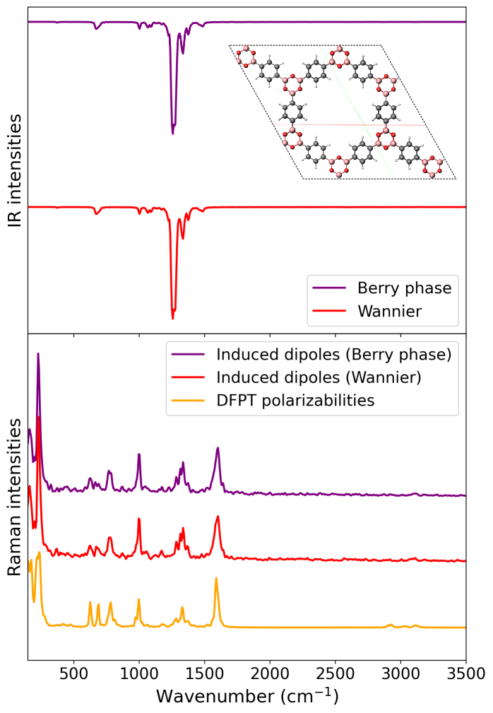

# MD-based Spectra of COF-1

In this example, we show how one can compute MD-based IR and Raman spectra for a covalent organic framework (COF), COF-1, a study we [previously published](https://pubs.acs.org/doi/full/10.1021/acs.jctc.4c01021), where one can find the results explained in more detail and direct comparison to experiment.

We start with the IR calculations, the directory `/MD-based/IR_Berry/` contains the Berry phase dipole moments `berry_dipole_free_sc.xyz` for the COF-1 system for 5000 snapshots (12.5 ps) together with `input.txt`. The directory `/MD-based/IR_Wannier/` contains the nuclear and Wannier center coordinates given in `wannier.xyz`, instead of the Berry phases. Running either of these calculations produce the file `IR_spectrum.txt` which contains the frequencies and MD-based IR intensities, and it can be plotted with a Python script as shown in the [Quick Start](Quick_Start.rst) section. `vibrant` also produces the file `result_cvv.txt`, which contains the raw dipole autocorrelation data before the Fourier transformation.

Raman calculations for the same system is given also in the directory `/MD-based/` under three subdirectories called `Raman_Berry`, `Raman_Wannier` and `Raman_Pol`, where the first two uses the induced dipole approach and the last one directly uses the polarizability tensors computed via density functional perturbation theory (DFPT), as explained in section [Raman spectra](Raman_spec.md#c-different-polarizability-tensors). Running any of these calculations produce:

- `raman_unpolarized.txt` → contains the total (unpolarized) intensities
- `result_cvv_iso.txt` → contains the isotropic polarizability time-autocorrelation data
- `result_cvv_aniso.txt` → contains the anisotropic polarizability time-autocorrelation data

Additionally, invoked with setting the keyword <a href="Keyword_Glossary.html#spectra_verbosity">''</a> to `high`, the `Raman_Berry` example produces extra spectrum files that contain the orthogonal (`raman_orthogonal.txt`) and parallel intensities (`raman_parallel.txt`), as well as the depolarization ratios (`raman_depolarization_ratio.txt`), as explained in section [Raman spectra](Raman_spec.md#c-different-polarizability-tensors).

The following figure shows the calculated IR and Raman spectra of COF-1 from each exercise:

  

  
   
  

MD-based vibrational spectra of COF-1. The top panel shows the IR spectra computed using Berry phase dipole moments and Wannier centers. The bottom panel presents the corresponding Raman spectra, where the polarizabilities are obtained either from induced dipoles using the indicated methods or directly from DFPT polarizability files. The top view of the COF-1 supercell is also shown.
   

   

