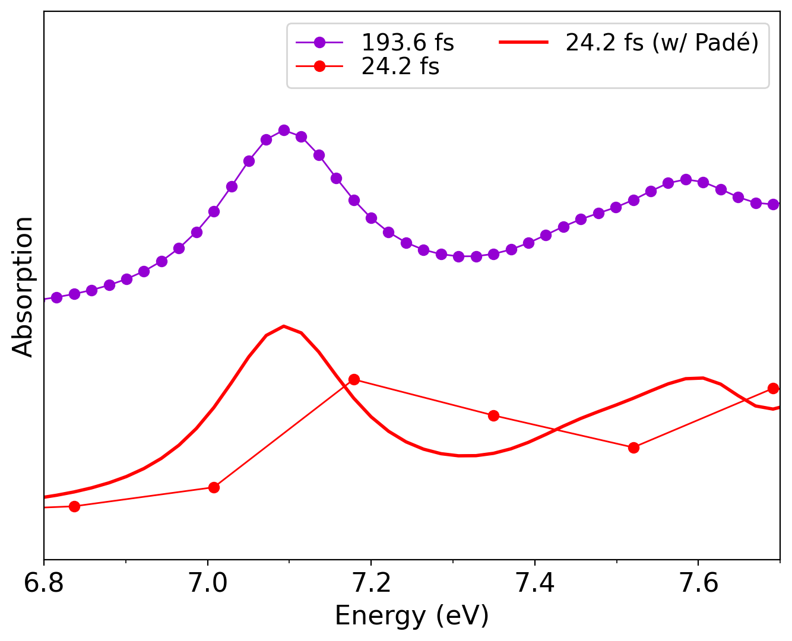
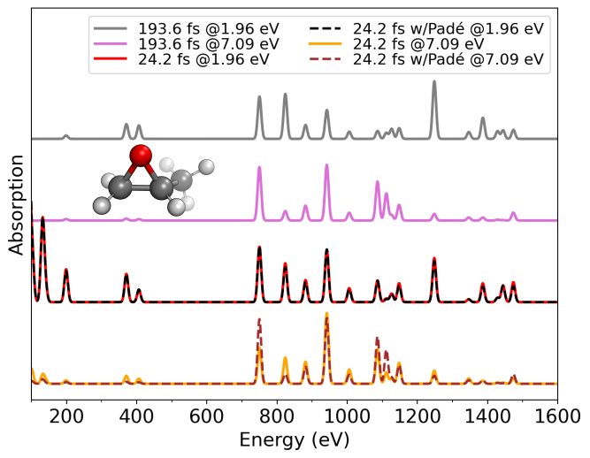

# Static resonance Raman and absorption spectra of _R_-methyloxirane

In this example, we calculate the static resonance Raman (RR) and absorption spectra with `vibrant`, with and without Padé approximants, post-processing the RT-TDDFT dipole moment trajectories. Our model system is the _R_-methyloxirane molecule, a molecule which was [previously studied](https://pubs.aip.org/aip/jcp/article/149/17/174108/197213) for its resonance profile. We start with the absorption spectrum calculations, given in the directory `/Static/Absorption/`. One can see that this folder contains two subfolders, named as `normal` and `Pade`. Starting with the `normal` subfolder, alongside `input.txt` and the main geometry file `r-met.xyz`, we see the three files containing the time-dependent dipole moment trajectories, named `r-met_RTP_dipoles_static_X_10000.xyz`,`r-met_RTP_dipoles_static_Y_10000.xyz`,`r-met_RTP_dipoles_static_Z_10000.xyz`, appended as instructed in the section [File Formats](file_formats.md#62-static-spectra-based-on-normal-modes), and contain 10000 RT-TDDFT time steps which are 2.42 as apart.

 ```{note}
  In this example, the files `r-met_RTP_dipoles_static_X_10000.xyz`,`r-met_RTP_dipoles_static_Y_10000.xyz`,`r-met_RTP_dipoles_static_Z_10000.xyz` contain the time-dependent polarizabilities for all displaced structures. However, this is not necessary as the user can also give the polarizability tensors for only one structure, for example for only the optimized geometry. Either way, `vibrant` generates the absorption spectrum for only one structure, since the very small displacements (~0.001 Å) in the geometry should not significantly affect the resulting absorption spectrum.
```

 the absorption peak to the correct position, achieving convergence with a much shorter trajectory.
Running this calculation generates the `absorption_spectrum.txt` file, which can be plotted with a Python script as shown in the [Quick Start](Quick_Start.rst) section.

The `Pade` directory contains exactly the same data files, with the only difference being in the `input.txt` file, where the Padé interpolation is invoked:

```bash
...
&rtp
...
 check_pade y
 pade_framecount 80000
 damping_constant 0.1
&end rtp
```

To speed-up the calculation, the user use multiple threads, typing `export OMP_NUM_THREADS=<num_threads>`. More information is given on [Application of Padé interpolation](Resonance_Raman_spec.md#c-application-of-padé-interpolation) subsection.

This calculation again generates a `absorption_spectrum.txt` file, but one can see that with a finer resolution and more data points. The following plot compares the two absortion spectra computed with and without Padé approximants, together with a reference absorption spectrum, which was generated from an 8 times larger (193.6 fs of simulation time) trajectory:

<div style="display:flex; justify-content: center; align-items: center;">
  <div style="width: 500px;">
  
  <br>
  <div style="display: block; padding: 20px; color: gray; text-align: justify;">

Absorption spectra of _R_methyloxirane calculated with and without Padé approximants for a trajectory of 24.2 fs length. As reference, the absorption spectrum of the same molecule from a 193.6 fs RT-TDDFT trajectory is also shown.

   </div>
   </div>
</div>

The figure clearly demonstrates how the Padé interpolation effectively increases the resolution and "shifts" the absorption peak to the correct position, achieving convergence with a much shorter trajectory.

The RR example for the same molecule can be found in `/Static/Resonance_Raman/`. This directory again contains two subdirectories called `normal` and `Pade`. Starting with the example in the `normal` directory, we see that in addition to the files given for the absorption calculation, there is also the file which contains the atomic forces `r-met-force.data3` for calculating  normal mode frequencies and coordinates, which are required for the RR intensities. The input file contains two incident laser frequencies:

```bash
...
&raman
 laser_in 1.96 7.09
&end raman
```

where the first frequency refers to a non-resonant condition, and the second frequency (7.09 eV), corresponds to the absorption peak shown in the above figure. This calculation generates the normal mode frequency and normal mode coordinate files `normal_mode_freq.txt` and `normal_mode_displ.txt`, the absorption spectrum `absorption_spectrum.txt` for the first displaced structure, and the RR spectrum `result_static_resraman.txt`, which contains the broadened frequencies together with the intensities generated for each requested laser frequency:

```bash
                  FREQ         INT   1.960000 eV         INT   7.090000 eV
                     1   8.6120137234603025E-060   5.6217780997885689E-057
                     2   1.5631351458871240E-058   1.0203884030304577E-055
                     3   2.7259417010010877E-057   1.7794490171609807E-054
                     4   4.5673555361940649E-056   2.9814930806922818E-053
                     5   7.3526060388951820E-055   4.7996578887505357E-052
                     6   1.1372239418077428E-053   7.4236071328985353E-051
                     7   1.6899696787979389E-052   1.1031838585779244E-049
                     8   2.4129040464463554E-051   1.5751032871964592E-048
                     9   3.3100108057663809E-050   2.1607195315109428E-047

```

Similarly to the absorption example, the version of the same exercise with the application of Padé interpolation can be found on `/Static/Resonance_Raman/Pade/`. Running this calculation generates the same set of files, but this time with a much better resolution. The following figure shows the obtained RR spectra from both exercises:

<div style="display:flex; justify-content: center; align-items: center;">
  <div style="width: 500px;">
  
  <br>
  <div style="display: block; padding: 20px; color: gray; text-align: justify;">
RT-TDDFT RR spectra for _R_methyloxirane computed at different excitation frequencies (1.96 eV and 7.09 eV) with and without Padé approximants. The spectra calculated from 193.6 fs length of RT-TDDFT trajecory is also given as a reference.
   </div>
   </div>
</div>

The figure shows that the 1.96 eV trajectory fails to fully capture the resonance features due to limited spectral resolution. In contrast, applying Padé approximants recovers the correct enhancement of peaks in resonance at 7.09 eV, yielding convergence comparable to the spectrum obtained from the 193.6 fs RT-TDDFT trajectory.

 ```{note}
The user can also directly give the normal mode frequencies and displacements instead of performing a normal mode analysis, such as in the example [Static spectral calculations for water molecule](examples_static_water.md). Also the user can print a `.mol` file using the keyword <a href="Keyword_Glossary.html#keyword-write_mol_file">'write_mol_file'</a> to visualize which modes get enhanced with [MOLDEN](https://www.theochem.ru.nl/molden/).
```