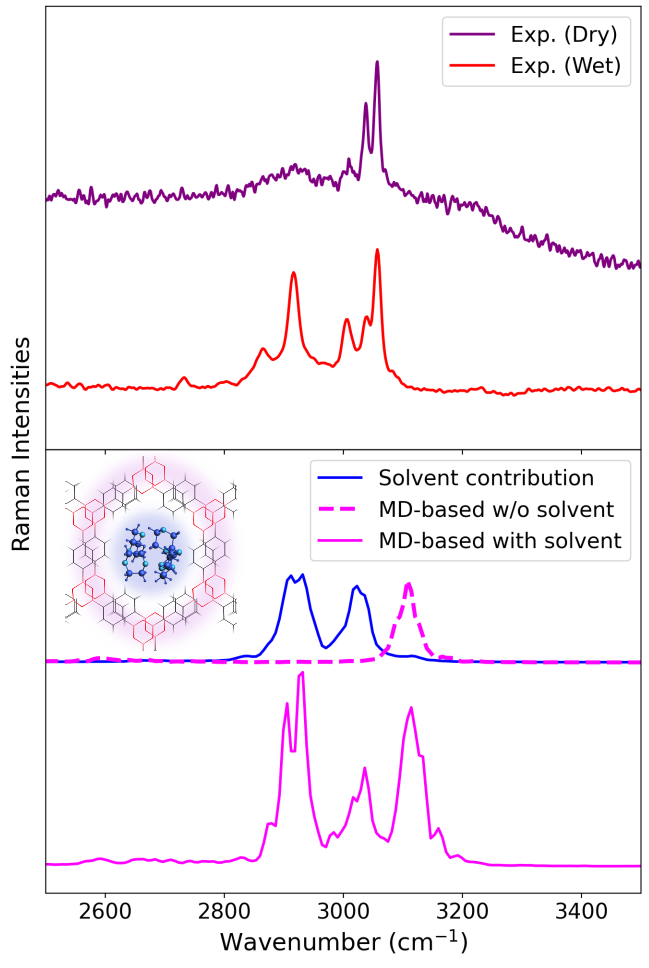

# Dissection of the vibrational spectra of COF-1

In this example, we show how one can compute the spectra for the molecular fragments of a covalent organic framework (COF-1) system, COF-1, using `vibrant`. The system we chose also includes solvent molecules, 1,4-dioxane, inside the COF-1 pores. More specifically, we will compute the spectra for these solvent molecules, and also for the boroxine units of COF-1. The example calculations for the IR and Raman spectra are in the directories `/MD-based_Subspectra/IR/` and `/MD-based_Subspectra/Raman/`, respectively. This study is also available in [our previous publication](https://pubs.acs.org/doi/full/10.1021/acs.jctc.4c01021), where one can find the results explained in more detail and direct comparison to experiment.

We start with the IR spectra. `COF-1_solv_wannier_free.xyz` contains the nuclear and Wannier positions for each MD frame. The input file `input.txt` contains:

```bash
&global
 spectra MD-IR
&end global
&dipoles
 type_dipole wannier
 dip_file COF-1_solv_wannier_free.xyz
&end dipoles
&system
 &cell
  box_x 15.100 
  box_y 15.100
  box_z 20.172
  angle_alpha 90
  angle_beta 90
  angle_gamma 120 
 &end cell
 &fragment
  atom_list 237 239 241 243 245 247 
  atom_list 265 226 228 230 261 263
  atom_list 307 272 270 303 305 268
  atom_list 285 279 281 283 289 287
  atom_list 310 347 345 314 312 349
  atom_list 329 327 325 323 321 331
  atom_list 100 102 104 139 135 137
  atom_list 117 115 113 119 111 121 
  atom_list 161 155 157 159 153 163
  atom_list 142 181 144 146 177 179
  atom_list 184 223 221 219 188 186
  atom_list 201 199 197 195 205 203
 %end fragment
 &fragment
  atom_list 43 56 50 44 47 53 46 52 45 55 48 49 54 51
  atom_list 15 28 16 25 22 19 26 27 24 23 17 18 20 21
  atom_list 38 42 33 30 29 39 36 32 31 34 35 37 40 41
  atom_list 14 11 12 8 9 10 2 4 7 6 5 1 3 13
  atom_list 70 64 65 67 68 69 57 58 61 60 59 62 63 66
  atom_list 98 97 93 94 92 95 96 89 90 85 86 88 91 87
  atom_list 71 74 73 80 79 72 84 76 75 81 83 82 78 77
 %end fragment
%end system
&md
 time_step 2.5
 correlation_depth 1024
&end md
```

where the first `fragment` section includes all the boroxine units, each of them being listed in each `atom_list` keyword. The second `fragment` section includes all the atomic indices for the seven solvent molecules in the system. Running this calculation generates two output files, which can be plotted with a Python script as shown in the [Quick Start](Quick_Start.rst) section. These files include:

- `IR_spectrum_fragment_1.txt` → includes the IR intensities for the boroxine fragments
- `IR_spectrum_fragment_2.txt` → includes the IR intensities for the solvent fragments

Next, we proceed with the Raman calculation, which includes all MD Wannier trajectories both with and without the applied electric field. In the provided `input.txt`, only one fragment section is defined for the solvent molecules, so the calculation will yield the Raman spectrum exclusively for the solvent. The resulting file, `raman_unpolarized_fragment_1.txt`, can be plotted using a Python script in the same way as before.

A complete dissection of the COF-1 system into molecular blocks is previously shown in the section [Subspectra for MD-based calculations](fragments.md). Therefore, we will focus on the analysis of the solvent contribution in this exercise. The following figure shows the Raman spectrum of the solvent molecules. Additional spectra are included for comparison, as explained in the caption, and are taken from [our previous publication](https://pubs.acs.org/doi/full/10.1021/acs.jctc.4c01021).


<div style="display:flex; justify-content: center; align-items: center;">
  <div style="width: 500px;">
  
  <br>
  <div style="display: block; padding: 20px; color: gray; text-align: justify;">

  Upper plot shows the experimental Raman spectra of COF-1 before and after the material is dried. Lower plot shows the calculated Raman spectra from two MD simulations of COF-1, one containing the solvent molecules (1,4-dioxane) inside the pores and the other one being the pristine material. The extracted spectrum of the solvent molecules is also shown in blue. This method safely ensures that the peaks at around 2850 cm $^{-1}$ and 3050 cm $^{-1}$ are indeed resulting from the solvent residues and no other impurity. The molecular representation of the material is also given inside the lower plot, where COF-1 framework is higlighted in pink and the solvent molecules inside the pore are highlighted in blue.

   </div>
   </div>
</div>