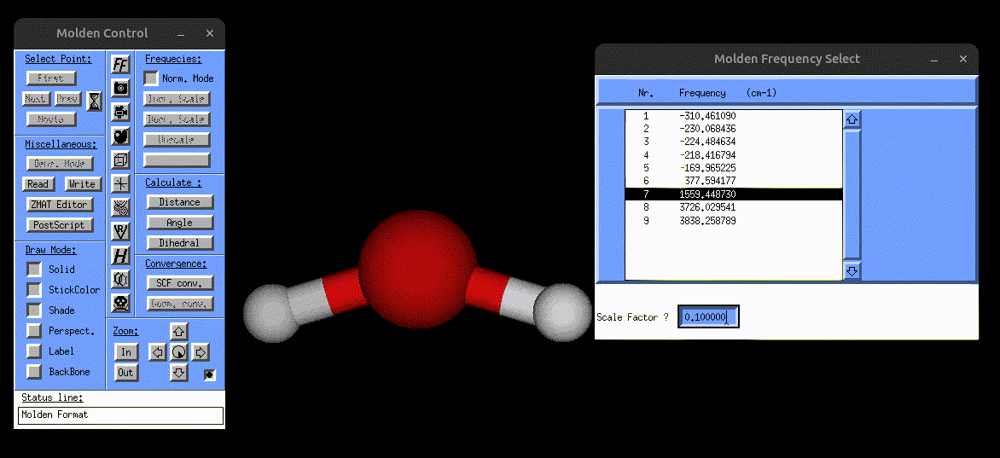
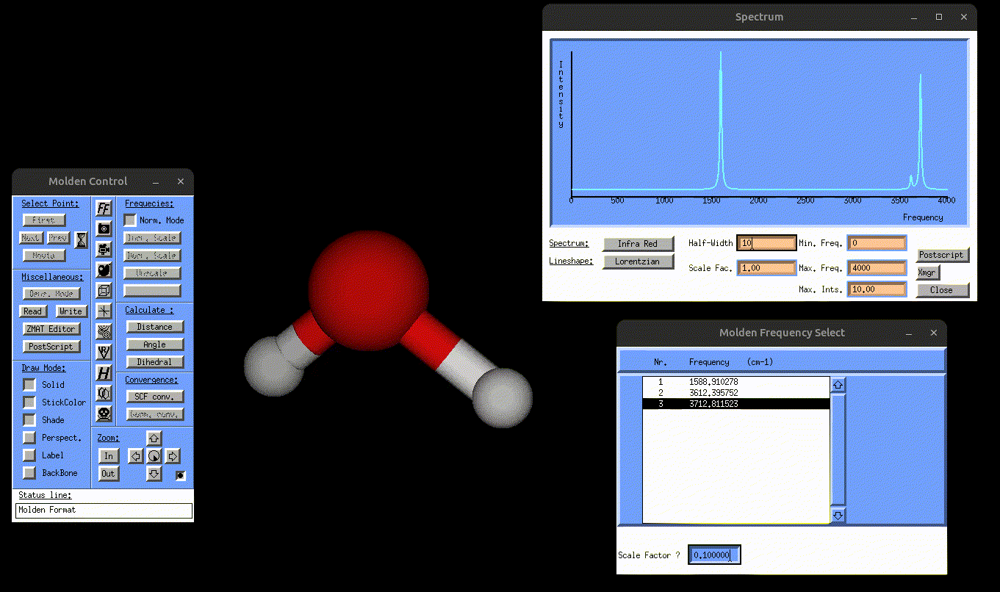
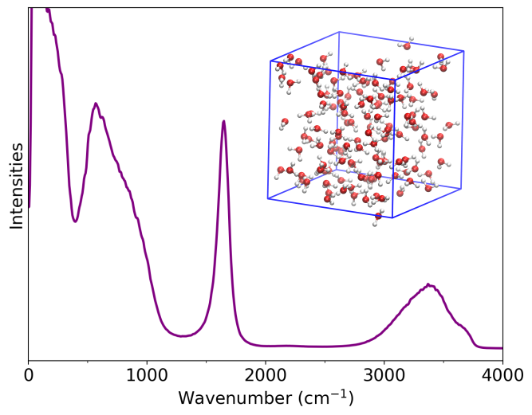

# Static spectral calculations for water molecule

## Normal mode analysis

The test calculation on the directory `/Static/Normal_mode_analysis` demonstrates how one can carry out a normal mode analysis for a simple water molecule providing the and giving the geometry file `water.xyz` and the file which contains the atomic forces `water-force.data` (see [File Formats](file_formats.md#21-atomic-forces) for more details on how to append the atomic forces for each displaced structure.) The input file is then given as:

```bash
&global
 spectra NMA
&end global
&system
 filename water.xyz
&end system
&static
  &hessian
   force_file water-force.data
  &end hessian
  displacement 0.001
  write_mol_file
&end static
```

This calculation generates three output files named:

- `normal_mode_freq.txt` → contains normal mode frequencies

```bash
 # Normal mode freq. (cm^{-1})
  -176.97535653970249     
  -176.42583329045769     
   105.51923823199118     
   193.50471510887877     
   230.82082299950909     
   275.41014020547584     
   1588.9102733774585     
   3612.3956359220965     
   3712.8115592866070     
```

where the last 3 frequencies correspond to the bending, symmetric stretching and asymmetric stretching modes of water. The first 6 modes correspond to the translational and rotational mode frequencies and can be disregarded by the user. The reason some of them show negative frequencies is because the molecular structure used for the normal mode analysis is not tightly optimized.

- `normal_mode_displ.txt` → contains normal mode displacements, i.e., we print for each mode $p$ and each atom $k$, the Cartesian displacement vector:
$$
d_{k\alpha}^{(p)}
= q_{\text{vis}}^{(p)} \,\frac{\tilde u_{k\alpha}^{(p)}}{\sqrt{m_k}},
\qquad \alpha \in \{x,y,z\}.
$$

where $\tilde{\mathbf{u}}_p$ are the mass-weighted eigenvectors and $m_k$ is the mass of atom $k$ in atomic units. $q_{\text{vis}}^{(p)}$ is a parameter for the visualization with the unit $\sqrt{\textnormal{mass}} \cdot \textnormal{length}$. We simply set this parameter to 1 $\sqrt{\textnormal{u}}\cdot$ bohr, so that the total unit of $\mathbf{d}_k^p$ is in bohr.  

```bash
# first atom in first vibrational mode
  0.94616809213469699        2.7946421871026641E-005  -2.9767288434384802E-002
# second atom in first vibrational mode
  0.22740474089226850        1.2654307516200803E-002  -8.3175715860303919E-003
# third atom in first vibrational mode
  0.22740216306823607       -1.2642516133164316E-002  -8.1266552822378130E-003
 ...
# first atom in last vibrational mode
  0.26728409439256395        4.0116848009155714E-006  -8.2828918268760410E-007
# second atom in last vibrational mode
 -0.53240940739379650      -0.42525005582409653       -9.0204921754870363E-007
# third atom in last vibrational mode
 -0.53238715822178384       0.42523609861802070       -1.2091347908508780E-010

```

- `vibrations.mol` → can be opened with [MOLDEN](https://www.theochem.ru.nl/molden/) to visualize the normal mode vibrations

The following screenshot shows how one can use the `vibrations.mol` file to visualize the normal modes via [MOLDEN](https://www.theochem.ru.nl/molden/):

<div style="display:flex; justify-content:center; align-items:center; flex-direction:column;">
  
  <p style="color:gray; font-size:0.9em; text-align:center; margin-top:10px;">
    Visualization of the bending mode of water.
  </p>
</div>

## Static IR and Raman spectra for water molecule

The next example is about the static IR and Raman calculation of the water molecule. Starting with the IR calculation on `/Static/IR/`, one can see that now there are some new files in addition to the `input.txt` and `water.xyz` files, named:

- `normal_mode_freq.txt` and `normal_mode_displ.txt` → normal mode frequencies
and normal mode coordinates (See [File Formats](file_formats.md#22-normal-mode-frequencies-and-coordinates) for the formatting of these file)

- `dipoles_water.xyz` → contains the dipole moments for all displaced structures (See [File Formats](file_formats.md#32-static-spectra-based-on-normal-modes) for the formatting)

This example does not perform a normal mode analysis, and instead uses the user-provided normal mode frequencies and coordinates. Running the calculation generates two files:

- `result_static_ir.txt` → contains broadened IR spectrum
- `IR.mol` → can be opened with [MOLDEN](https://www.theochem.ru.nl/molden/) to visualize the normal mode vibrations, but this time also the IR spectrum, as shown in the following gif:

<div style="display:flex; justify-content:center; align-items:center; flex-direction:column;">
  
  <p style="color:gray; font-size:0.9em; text-align:center; margin-top:10px;">
    Visualization of the antisymmetric stretching mode of water, alongside the IR spectrum.
  </p>
</div>

The IR spectrum can be obtained directly using the chosen broadening method and full width at half maximum (FWHM). Alternatively, one may plot the Gaussian-broadened file `result_static_ir.txt` produced by `vibrant` with the desired FWHM value, for example using Python or Gnuplot. An example Python script is given in the [Quick Start](Quick_Start.rst) section.

The Raman calculation can be found in the directory `/scratch/ekin/Examples/Static/Raman`. This example uses again the atomic forces to calculate the normal mode frequencies and coordinates. It also uses the `polarizabilities.dat` file for the polarizability tensors. Details on the format of this file is given in the [File Formats](file_formats.md#52-static-spectra-based-on-normal-modes) section.

```bash
&global
 spectra R
 temperature 300
 fwhm 5
&end global
&system
 filename water.xyz
&end system
&static
 diag_hessian y
 &hessian
  force_file water-force.data
 &end hessian
 displacement 0.001
 write_mol_file
&end static
&polarizabilities
 type_pol analytical
 static_pol_file polarizabilities.dat
&end polarizabilities
&raman
 laser_in 2.540639
&end raman
```

This calculation generates four files, again the normal mode frequency and normal mode coordinate files `normal_mode_freq.txt` and `normal_mode_displ.txt`, and also the `result_static_raman.txt` file which contains the broadened frequencies and the Raman spectrum and can be plotted with, for example, Python. Additionally, `Raman.mol` can again be opened with [MOLDEN](https://www.theochem.ru.nl/molden/) to visualize the normal modes alongside the Raman spectrum.

## Bonus: Power spectrum of liquid water 

After running the static calculations for the water molecule, one can also calculate the MD-based power spectrum of liquid water, as provided in the directory `/MD-based/Power_Spectrum/`.  The directory includes the `waterbulk-pos-1.xyz` file which contains the atomic positions of the water simulation box for several MD snapshots, and also the input file `input.txt`. Running the calculation produces two files:

- `power_spec.txt` → contains the power spectrum
- `result_acf_velocities.txt` → contains the velocity autocorrelation data

The files can be visualized with a Python script as described above. The resulting power spectrum is shown below:

<div style="display:flex; justify-content: center; align-items: center;">
  <div style="width: 500px;">
  
  <br>
  <div style="display: block; padding: 20px; color: gray; text-align: justify;">

Power spectrum of liquid water.

   </div>
   </div>
</div>
