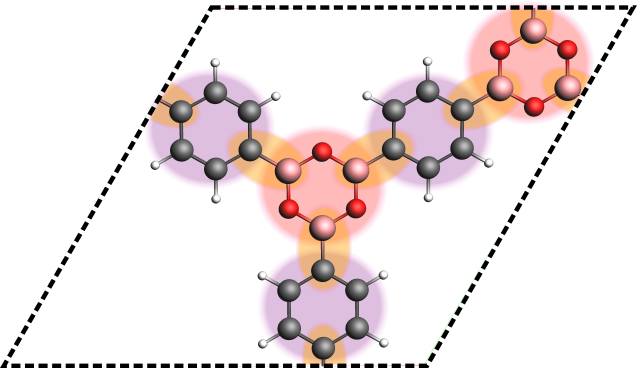
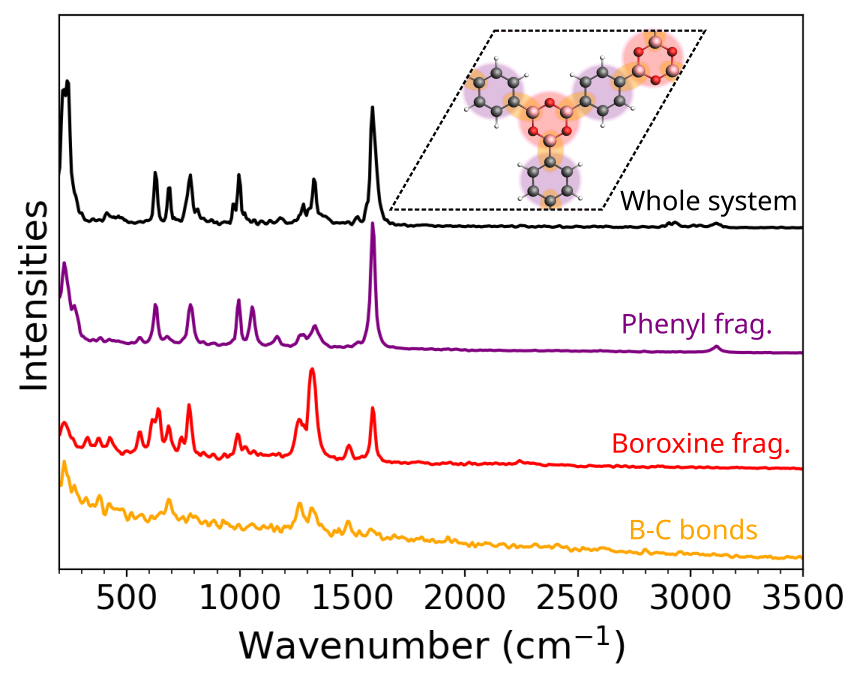

# Subspectra for MD-based calculations

`vibrant` can compute the molecular dynamics (MD)-based IR or Raman subspectra of specified molecular blocks or fragments by processing the Wannier centers. This is especially useful for extracting the solvent contribution in a system consisting of a material + solvent. Additionally, molecular blocks found in framework systems (such as covalent organic frameworks, denoted as COFs) can similarly be specified in a list to extract their subspectra, allowing the analysis of individual contributions on the spectrum. To calculate any subspectra, the user first must provide the list of the indices of all atoms belonging to that fragment. Multiple fragment blocks can be specified by the user, each consisting of several atom lists. The following figure demonstrates how the molecular blocks in a framework system may look like:

<div style="display:flex; justify-content: center; align-items: center;">
  <div style="width: 500px;">
  
  <br>
  <div style="display: block; padding: 20px; color: gray; text-align: justify;">

  Assigned fragments in a framework system (COF-1). The boroxine and phenyl fragments of the system are highlighted in red and purple, the connecting B-C bonds are highlighted in orange.

   </div>
   </div>
</div>

An example input section for computing fragment-based spectra is shown below:

```bash
&system
...
 &fragment
  atom_list <index_1> <index_2> <index_3> ...
  atom_list <index_1> <index_2> <index_3> ...
  atom_list <index_1> <index_2> <index_3> ...
.....
 &end fragment
 &fragment
  atom_list <index_1> <index_2> <index_3> ...
  atom_list <index_1> <index_2> <index_3> ...
  atom_list <index_1> <index_2> <index_3> ...
...
 &end fragment
 ...
&end system
```

For instance, the phenyl and boroxine fragments of COF-1 can be given in different `fragment` blocks. However, all fragments in a fragment block (indicated with the keyword `atom_list`) must consist of the same number of atoms. The rest of the input file must include all the other necessary sections for computing [MD-based Raman Spectra](Raman_spec.md#b-md-based-raman-intensities) or [MD-based IR Spectra](IR_spec.md#b-md-based-ir-intensities).

Based on a distance cut-off criteria which relies on periodic boundary conditions (PBC), `vibrant` scans through all Wannier centers in the provided file and assigns them to the individiual molecular blocks. Afterwards, center of mass of each fragment is calculated, which serves as the reference point. The dipole moment contribution of the specified molecular block is computed based on the distances and charges of the fragment atoms with respect to the defined center of mass. More information on the equations is provided in the subsection ["Dipole moment types"](IR_spec.md#c-dipole-moment-types) of the IR section. For all given `fragment` blocks, `vibrant` prints out the requested spectra in separate files, such as in the form:

- IR_spectrum_fragment_1.txt
- IR_spectrum_fragment_2.txt
- ...

An example taken from our [previous publication on the MD-based vibrational spectra of layered materials](https://pubs.acs.org/doi/full/10.1021/acs.jctc.4c01021), shows how this method can be utilized to dissect a spectrum:

<div style="display:flex; justify-content: center; align-items: center;">
  <div style="width: 500px;">
  
  <br>
  <div style="display: block; padding: 20px; color: gray; text-align: justify;">

The AIMD-based Raman spectra for pristine COF-1 calculated from Wannier centers. The subspectra of the boroxine/phenyl units and B-C bonds are calculated by defining fragments. The prominent peaks are highlighted. This method helps in dissecting and characterizing the overall MD-based spectrum.

   </div>
   </div>
</div>

Another example is [the dissection of the overall spectrum into solvent and material](https://pubs.acs.org/doi/full/10.1021/acs.jctc.4c01021), and some results are shown in the exercise ["Dissection of the vibrational spectra of COF-1"](examples_fragments.md).

More information on the all available keywords can be found on [Keyword Glossary](Keyword_Glossary.rst) and all complete example input files are available on [Examples](Examples.md).